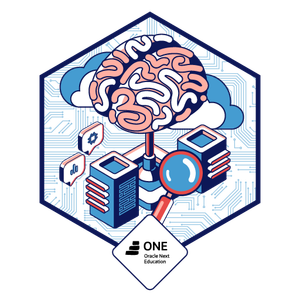

     
# Mentis: Agente Clínico Inteligente RAG

Asistente virtual autónomo diseñado para la autogestión de información, encuadre y políticas del consultorio psicológico de la **Lic. Carina Bosio**.

*(Se recomienda hacer **Ctrl + Clic** o **Clic derecho > Abrir en una pestaña nueva** para no salir de esta página).*

## 🚀 Acerca del Proyecto

Mentis nació como un desafío técnico para resolver una necesidad real del ámbito clínico: optimizar la comunicación de normativas, horarios y encuadres psicoterapéuticos con los pacientes. Este proyecto me permitió profundizar la integración de mi formación en **Psicología con el desarrollo Frontend y la Inteligencia Artificial**.

El objetivo principal fue crear a **Menti**, un asistente que no solo sea un recuperador de datos frío, sino una solución flexible y **omnicanal**. El sistema permite a los usuarios interactuar de forma indistinta a través de dos frentes integrados al mismo "cerebro" en la nube:

- **Una Plataforma Web Moderna (React):** Ofrece una interfaz inmersiva, interactiva y responsiva ideal para consultas desde el sitio del consultorio.
- **Un Canal Automatizado de Telegram:** Pensado para la mensajería instantánea del paciente desde su celular con una accesibilidad inmediata.

Toda la lógica de Menti mantiene la calidez y el respeto por el encuadre profesional, incorporando una UX fluida mediante animaciones dinámicas que reducen la fricción cognitiva del usuario durante la espera de respuestas complejas.

## 🛠️ Stack Tecnológico

| **Componente**     | **Tecnologías y Librerías Utilizadas**                                                |
| :----------------- | :------------------------------------------------------------------------------------ |
| **Frontend**       | React, Vite, TypeScript, CSS Moderno, GSAP (GreenSock Animation Platform)             |
| **Renderizado**    | React Markdown (procesamiento limpio de textos devueltos por la IA)                   |
| **Orquestación**   | n8n (Flujos lógicos, agentes autónomos avanzados y memoria de sesión)                 |
| **IA & Lenguaje**  | Cohere Chat Model (Modelo `command-r-plus` para la generación avanzada de respuestas) |
| **Embeddings**     | Cohere Embeddings (Procesamiento y vectorización multilingüe para el contexto RAG)    |
| **Base Vectorial** | Neon Serverless PostgreSQL (con extensión `pgvector` para el almacén RAG)             |
| **Entorno Local**  | Node.js (Servidor de desarrollo acelerado por Vite en puerto 5173)                    |

## 🧠 Características Principales

- **Recuperación Aumentada (RAG):** Conexión nativa a la base de datos vectorial para indexar y consultar dinámicamente los documentos de políticas de admisión, ausencias, aranceles y WhatsApp del consultorio.
- **Cerebro Unificado Omnicanal:** Arquitectura centralizada que permite abastecer de manera simultánea a la plataforma Web y al bot de Telegram desde un mismo Agente de IA, garantizando consistencia en las respuestas del consultorio.
- **Frontend 100% Responsivo:** Interfaz de usuario diseñada bajo estándares modernos de adaptabilidad, ofreciendo una experiencia fluida y optimizada tanto en dispositivos móviles (smartphones) como en escritorios de escritorio.
- **UX Premium con GSAP:** Coreografía elástica en el Lobby para la eclosión orgánica del imagotipo y la transición limpia hacia el panel de mensajes.
- **Foco Automático e Interactividad:** Retorno inmediato del enfoque (`focus`) al input de texto apenas el asistente finaliza la generación de respuesta, logrando una conversación continua.
- **Spinner Elástico Personalizado:** Indicador de carga desarrollado mediante `@keyframes` puras en CSS para mejorar la experiencia de espera (_perceived performance_).

## 🏗️ Arquitectura del Flujo (n8n)

La solución utiliza una **Cadena de Retorno (Retrieval QA Chain)** orquestada de forma visual en n8n. El agente recibe la duda del paciente, extrae los fragmentos contextuales (_chunks_) pertinentes de la base de datos en Neon, y genera una respuesta limpia libre de asteriscos crudos o alucinaciones.

📥 **Archivos de Producción:** Los flujos lógicos completos de este backend se encuentran exportados en formato JSON en la carpeta `/n8n` de este repositorio, listos para ser importados y replicados en cualquier instancia de n8n.

## 📂 Estructura del Repositorio

- `/n8n`: Contiene los flujos lógicos de producción en formato JSON (`Mentis - Chatbot RAG.json` y `Mentis - Inyección de Documentos.json`), listos para ser replicados o importados directamente en cualquier instancia de n8n.
- `/src`: Código fuente del frontend (Componentes de chat, lógica core de React y estilos).
- `/src/components`: Componentes aislados como `MentisImagotipo.tsx` (estructura SVG optimizada).
- `/src/services`: Conectores de API y llamadas al flujo del agente (`ragAgent.ts`).
- `/public/docs`: Base de conocimientos que alimenta el RAG (`politicas_mentis.txt`, manuales PDF, preguntas frecuentes).

## 💡 Desafíos Técnicos

- **Ruteo Condicional Lógico en Entornos Stateless:** Uno de los mayores retos fue diseñar un nodo _Switch_ omnicanal que no se rompiera debido a la limpieza de variables que hace n8n entre ejecuciones alternativas. Se resolvió implementando lógica condicional avanzada mediante funciones nativas de validación estática (`$if` junto con el método `.isExecuted`), logrando evaluar con éxito qué Webhook inició el hilo sin dejar errores críticos por "nodos no ejecutados".

#### 📊 Evidencias de Enrutamiento en Caliente (QA):

A continuación se observa cómo el sistema discrimina el origen de la petición en tiempo real, iluminando el pipeline correspondiente sin generar colisiones de memoria:

**1. Petición activa procesada por el Canal Web:**

**2. Petición activa procesada por el Canal Telegram:**

- **Estandarización de Estructuras de Datos Heterogéneas:** Sincronizar la entrada de datos de Telegram (que maneja objetos de chat nativos) con los JSON estructurados enviados desde la aplicación en React requirió un mapeo minucioso mediante nodos _Edit Fields_. Se encapsularon los parámetros de entrada (`chatInput`, `sessionId` y `channel`) bajo la misma jerarquía del objeto `body` para homogeneizar el consumo del Agente de IA.
- **Pipeline de Ingestión Automatizada (ETL RAG):** Diseño y ejecución de un flujo secundario en n8n especializado en la inyección masiva de documentos hacia la base de datos en Neon. El proceso consume mediante peticiones HTTP un endpoint plano de configuración externa (Pastebin `/raw/`), procesa y segmenta jerárquicamente el contenido usando un _Default Data Loader_, genera los vectores semánticos con _Cohere Embeddings_ y los almacena de forma estructurada en las tablas de _PostgreSQL (PGVector)_.

- **Migración de Infraestructura RAG en la Nube:** Ante las restricciones de memoria del servidor inicial (Railway), se lideró la migración completa del backend de n8n hacia Hugging Face Spaces. Esto implicó la reconfiguración y el aprovisionamiento de cero de las variables de entorno, credenciales de APIs (Cohere) y la persistencia de datos vectoriales (Neon/PostgreSQL) en un nuevo entorno virtualizado.
- **Fluidez Estructural y Control de Hooks:** Mantener el scroll perfectamente encapsulado en el área de conversación, logrando que la barra lateral y la cabecera queden fijas. Organización estricta de los hooks de React y efectos de GSAP para evitar errores en consola durante los estados de carga de la IA.
- **Sincronización de Entornos (Vite + Vercel):** Resolución de conflictos de caché e inyección dinámica de endpoints mediante la purga y recompilación limpia de variables de entorno en producción.
- **Seguridad de Credenciales (Git/GitHub):** Saneamiento profundo del árbol de Git mediante comandos avanzados de terminal (`git rm --cached`) para remover históricos de archivos `.env` que persistían de forma invisible en el repositorio.

## 🌐 Despliegue y Acceso

El ecosistema completo se encuentra productivo, sincronizado en entornos multi-cloud y accesible de forma pública a través de las siguientes terminales:

- **Plataforma Web (Frontend):** Desplegada de forma continua en **Vercel** bajo un entorno seguro HTTPS de alto rendimiento.
  - 🔗 **Enlace de acceso directo:** [mentis-rag-agent.vercel.app](https://mentis-rag-agent.vercel.app/)
- **Orquestación del Backend (n8n):** Servidor persistente virtualizado de forma exitosa en la infraestructura de la nube a través de **Hugging Face Spaces**.
- **Base de Datos Vectorial:** Instancia relacional serverless hosteada en **Neon (PostgreSQL)** administrando los índices RAG activos.

## ⚙️ Rendimiento (Capas Gratuitas)

El proyecto está diseñado bajo una arquitectura distribuida para garantizar la modularidad y el desacoplamiento de los servicios. Al operar al 100% sobre **capas gratuitas (Free Tiers)**, el flujo experimenta una latencia de respuesta promedio de entre 7 y 10 segundos por mensaje.

### 🔄 Circuito de Comunicación por Pregunta:

1. **Frontend (Vercel):** Envía la consulta del usuario al webhook.
2. **Backend (Hugging Face Spaces - n8n):** Orquesta el flujo y delega la vectorización.
3. **Embeddings (Cohere AI):** Transforma el texto en vectores semánticos.
4. **Base de Datos (Neon Postgres + PGVector):** Realiza la búsqueda de similitud.
5. **Orquestación de Contexto (n8n):** Inyecta el manual recuperado al LLM.
6. **Modelo de Lenguaje (Cohere Chat):** Genera la respuesta final adaptada al rol institucional.

💡 **Nota de Ingeniería:** Esta latencia es un comportamiento esperado debido a las limitaciones de ancho de banda, priorización de tráfico y "arranque en frío" (_cold start_) de los proveedores gratuitos utilizados. En un entorno comercial/productivo con recursos dedicados, este circuito se reduce a menos de 1 segundo sin modificar una sola línea de código del proyecto. El Frontend maneja visualmente esta espera mediante un indicador de carga (_typing loader_) para asegurar una UX clara.

## 📽️ Demostración del Sistema (Demos Visuales)

Para apreciar la versatilidad de **Mentis** en todos sus canales, se presentan tres demostraciones en video que recorren la fluidez visual de la interfaz, su adaptabilidad móvil y la integración omnicanal.

---

### 💻 1. Experiencia de Escritorio (App Desktop)

> **Enfoque:** Interfaz responsive optimizada, animaciones fluidas con GSAP/ScrollTrigger, indicadores visuales de estado y una experiencia de usuario (UX) sumamente cuidada para pantallas grandes.

  

    <video src="https://github.com/user-attachments/assets/65a045a4-4e26-4eb6-85ba-8acc3287b92e" width="100%" controls style="border-radius: 4px; display: block;"></video>
  

_📂 **Ruta del archivo:** `public/img_readme/Web_Desktop.mp4`_

---

### 📱 2. Adaptabilidad Móvil (App Mobile)

> **Enfoque:** Diseño _mobile-first_ altamente interactivo. El menú lateral colapsable, la caja de chat adaptada a pantallas táctiles y la perfecta preservación de la identidad visual de la marca en dispositivos móviles.

  

    <video src="https://github.com/user-attachments/assets/369c6e3b-f230-4e0f-b041-cfb3dcd8517f" width="100%" controls style="border-radius: 4px; display: block;"></video>
  

_📂 **Ruta del archivo:** `public/img_readme/Web_Mobile.mp4`_

---

### 🤖 3. Integración Omnicanal (Telegram Mobile)

> **Enfoque:** Demostración del flujo RAG interactuando en tiempo real a través de Telegram. Se destaca la incorporación del botón nativo permanente **"Mentis App"** para una transición limpia hacia la web, el formateo HTML de las respuestas y la consistencia del "cerebro" del agente.

  

    <video src="https://github.com/user-attachments/assets/c653dddc-3511-47c8-90c5-fb811f5b1aaa" width="100%" controls style="border-radius: 4px; display: block;"></video>
  

_📂 **Ruta del archivo:** `public/img_readme/Telegram-mobile.mp4`_

---

_Desarrollado por [CariBosio](https://github.com/CariBosio) | Psicóloga + Frontend Developer_
